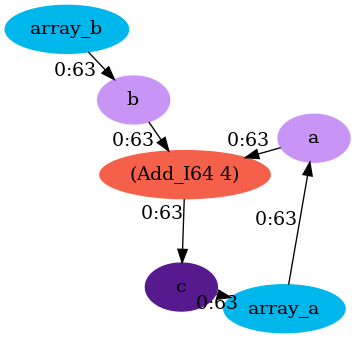
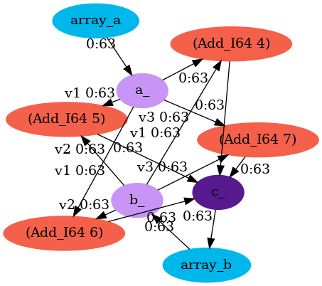
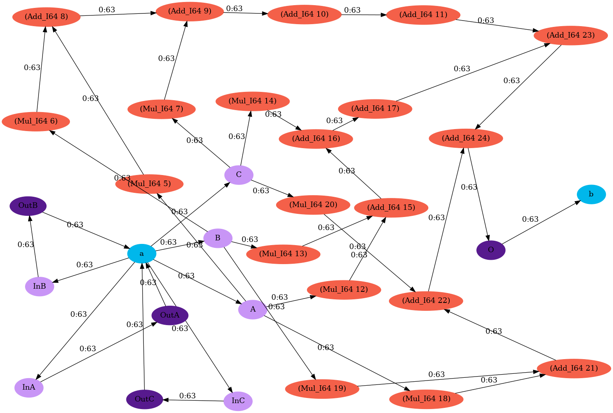

DFG File Examples
=================

Accumulate Example
------------------

The following is an example of a DFG file for a non-vectorized add operation:

::

   # Declare sub-dfg meta properties
   # Frequency is 0 as no work happens in this sub-dfg
   #pragma group frequency 0

   # Array Declaration
   Array: array_a 131072 dma
   Array: array_b 131072 dma

   ----
   # Declare sub-dfg meta properties

   #pragma group frequency 255
   #pragma group unroll 1

   # Port Declaration
   Input64: a source=array_a
   Input64: b source=array_b

   # Operation Declaration
   c = Add_I64(a, b)

   # Output Declaration
   Output64: c destination=array_a

This produces a dataflow graph that looks like the following:

Acc Vectorization Example
-------------------------

The following is an example of a DFG file for a vectorized-by-four add operation:

::

   # Declare sub-dfg meta properties
   # Frequency is 0 as no work happens in this sub-dfg
   #pragma group frequency 0

   # Array Declaration
   Array: array_a 131072 dma
   Array: array_b 131072 dma

   ----
   # Declare sub-dfg meta properties

   #pragma group frequency 255
   #pragma group unroll 4

   # Port Declaration
   Input64: a_[4] source=array_a
   Input64: b_[4] source=array_b

   # Operation Declaration
   c_0 = Add_I64(a_0, b_1)
   c_1 = Add_I64(a_1, b_1)
   c_2 = Add_I64(a_2, b_2)
   c_3 = Add_I64(a_3, b_3)

   # Output Declaration
   Output64: c_[4] destination=array_b

This produces a dataflow graph that looks like the following:

Complex Example
---------------

This is an example of a manually programmed DFG for the Stencil-2d workload.

:: 
   
   # Declare sub-dfg meta properties
   # Frequency is 0 as no work happens in this sub-dfg
   #pragma group frequency 0

   # Array Declaration
   Array: a 9248 dma
   Array: b 8192 dma

   ----
   # Declare sub-dfg meta properties
   # Most of the work happens here so we can set the frequency to 90 or 90%
   #pragma group frequency 90
   #pragma group unroll 1

   # Declare the input ports

   #pragma reuse=0.66
   Input64: A source=a
   #pragma reuse=0.66
   Input64: B source=a
   #pragma reuse=0.66
   Input64: C source=a

   # Do the operations
   MUL_0A = Mul_I64(A, $Reg0)
   MUL_0B = Mul_I64(B, $Reg0)
   MUL_0C = Mul_I64(C, $Reg0)

   TMPS0 = Add_I64(MUL_0A, MUL_0B)
   PSUM0 = Add_I64(MUL_0C, TMPS0)

   SHIFT0_REG0 = Add_I64(PSUM0, $Reg0)
   SHIFT0_REG1 = Add_I64(SHIFT0_REG0, $Reg0)

   MUL_1A = Mul_I64(A, $Reg0)
   MUL_1B = Mul_I64(B, $Reg0)
   MUL_1C = Mul_I64(C, $Reg0)

   TMPS1 = Add_I64(MUL_1A, MUL_1B)
   PSUM1 = Add_I64(MUL_1C, TMPS1)

   SHIFT1_REG0 = Add_I64(PSUM1, $Reg0)

   MUL_2A = Mul_I64(A, $Reg0)
   MUL_2B = Mul_I64(B, $Reg0)
   MUL_2C = Mul_I64(C, $Reg0)

   TMPS2 = Add_I64(MUL_2A, MUL_2B)
   PSUM2 = Add_I64(MUL_2C, TMPS2)

   PSUM3 = Add_I64(SHIFT0_REG1, SHIFT1_REG0)
   O = Add_I64(PSUM3, PSUM2)

   # Declare the output ports (there is no reuse)
   Output64: O destination=b

   ----
   # Declare sub-dfg meta properties
   #pragma group frequency 3

   # These are indirect stream generators
   Input64: InA source=a
   OutA = InA
   Output64: OutA destination=a

   ----
   # Declare sub-dfg meta properties
   #pragma group frequency 3

   # These are indirect stream generators

   Input64: InB source=a
   OutB = InB
   Output64: OutB destination=a

   ----
   # Declare sub-dfg meta properties
   #pragma group frequency 3

   # These are indirect stream generators

   Input64: InC source=a
   OutC = InC
   Output64: OutC destination=a

The resulting dataflow graph looks like the following:

.. toctree::
   :maxdepth: 2