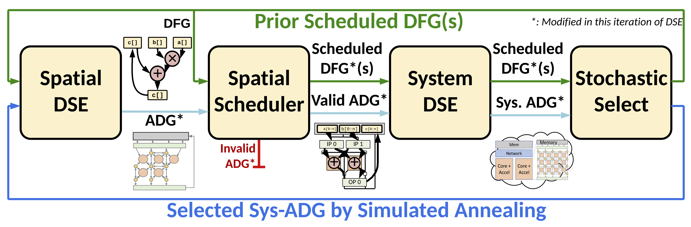

DSE Algorithm
=============

   **Figure 1:** DSE algorithm

The DSE algorithm is described within Figure 1. The algorithm works in several steps:

#. Spatial DSE
   
   In this step, the DSE modifies the inputed ADG. The algorithm randomly decides between adding, removing, or modifying different modular states. The number of modifications is determined by a temperature variable, which is set according to the iteration.

#. Spatial Scheduler

   After modifying the schedule, the scheduler then attempts to reschedule the modified DSE. If it fails to schedule or is overprovisioned, then the DSE iteration fails at this point and restarts using prior schedules.

#. System DSE

   During this step, the DSE uses the performance and resource models to determine the system parameters. The DSE fully explores the system parameters, chosing the design with the best performance and most cores, while remaining under full fpga utilization. 

#. Stochastic Selection

   Finally, the scheduler determines a new schedule according to 

.. toctree::
   :maxdepth: 2