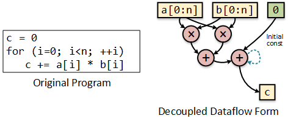
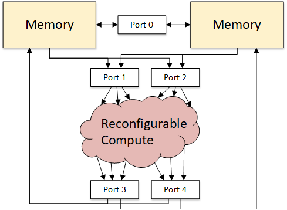
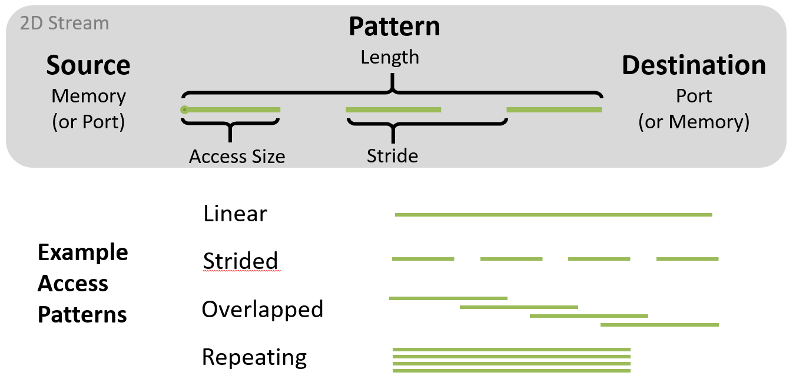

Stream-Dataflow Basics
==========================================

The `stream-dataflow <https://doi.org/10.1145/3079856.3080255>`_ 
execution model defines the interaction between
memory and computation.  In this model, memory is expressed
as ordered sequences of memory addresses in a given pattern -- we
refer to these as streams.
Computation is expressed as a dataflow graph using streams as inputs
and outputs.

The following is a simple example of a dot product.  In dataflow form
the streams are separated and expressed in a decoupled way from the computation
of the loop.  Its the ordering of the streams' data which gaurantees correct
computation.

In the stream-dataflow model specifically, which is what we use in DSAGEN, the
computation part is specified separately from the dataflow graph.  More specifically,
the dataflow graphs for computation are specified with a configuration instruction, 
while the streams are generated individually the program [#]_.  Therefore, we need
some way for the streams to communicate with the computation graph -- this is the 
job of *ports*.

Ports as the named connection points between memories (the things that execute
streams), and the computation graph.  They are somewhat like registers, but with
FIFO-like semantics.   The following shows the abstract view of an accelerator
with two memories, and some ports to connect various componts.

Streams have three basic components as shown below: a source, address pattern,
and destination.  This figure shows some example access patterns for a 2D affine
stream.  Different kinds of streams support different kidns of patterns.

There are two basic kinds of memory streams.

* **Memory -> Port**: Here the pattern describes which memory addresses are read.
* **Port -> Memory**: Here the pattern describes which memory addresses are written.

There are also a few streams that don't require an access pattern.

* **Port -> Port**: Recurrence value from output to input port.
* **Const -> Port**: Send a constant to a port.

Both of the above may have patterns, but these patterns are for specifying the repetitions
(or discarding) of data rather than an address.

.. [#]  This isn't quite an arbitrary decision, as there is an advantage to specifying
        computation independently.  Often times some aspect of a stream will change, but
        the underlying computation graph doesn't change.  By decoupling, a change in eg.
        the start address of a stream doesn't necessitate restating the dataflow graph.

