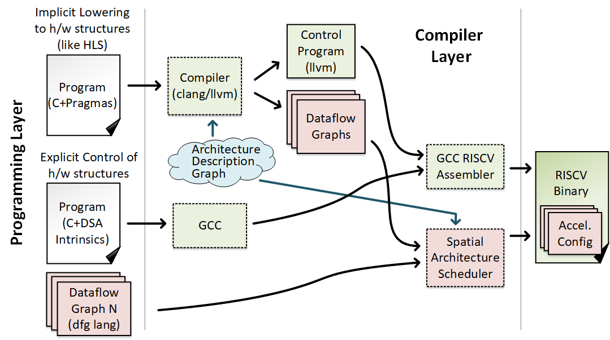

Programming
================================

There are two basic options for programming within DSAGEN: 

* **C + High-level Pragmas:**

  Here the programmer uses typical C programming abstractions, but annotates regions with pragmas
  to hint the compiler towards good implementations.  The compiler will use these annotations
  to split the program into control, and dataflow graphs (which consist of memory streams and
  dataflow instructions).

* **C + Low-level Intrinsics:**
  
  Here, the programmer explicitly describes the control program, which includes memory streams,
  as well as the dataflow graph that is mapped spatially onto the accelerator.
  Because DSAGEN accelerators are controlled by programmable core, the programmer still uses
  C, but must use lower level intrinsics to interact with hardware units.

This figure shows the basic compilation flow depending on which programming 
strategy is chosen; many components are similar.

Depending on the task, it may be easier to lower-level intrinsics.  Generally, the more you
ask out of the compiler (ie. the harder/more data-dependent/irregular the code is), the less
likely the compiler is to do what you want [#]_.  

Regardless of the model you use, it's helpful to understand the execution model of the hardware,
which is heavily inspired from `stream-dataflow <https://doi.org/10.1145/3079856.3080255>`_.  
Understanding the hardware makes the reasons and applicability of #pragmas more obvious, as
well as understanding assembly-level programming much easier.

We discuss the execution model seperately, as well as the two different programming
paradigms in the following pages.

.. toctree::
   :maxdepth: 2

   StreamDataflow/index
   PragmaProgramming/index
   IntrinsicProgramming/index

.. toctree::
   :maxdepth: 2

.. [#] Less likely for now at least, we're working on it.

