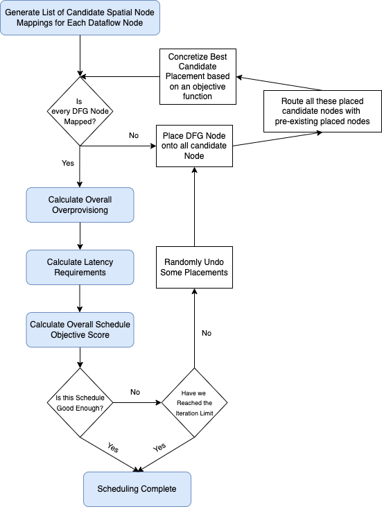

Spatial Mapping Algorithm
=========================

   **Figure 1:** The Spatial Scheduler Algorithm

The spatial scheduler workflow is described in Figure 1. In the first step, the spatial scheduler first generates a list of possible candidate placements for each dataflow node. These candidate mappings must follow certain requirements, like ensuring proper bitwidth alignment and the processing element having the correct functions. If any dataflow node does not have any possible candidates, we can safely terminate the scheduling process, as there exists no mapping that works for this dataflow graph.

The spatial scheduler then moves to routing, placing all possible combinations and attempting to find the best possible mapping spot. The spatial scheduler uses Dijkstra's algorithm to find the shortest path between nodes, creating distinct datapath's for each edge of the dataflow graph. To evaluate a candidate node mapping's effectiveness, the spatial scheduler evaluates an objective function, measuring the schedule's overall performance. If multiple candidate nodes have the same objective score, which frequently happens in practice, then the spatial scheduler will randomly choose a candidate to concretize. The routing process will continue until each dataflow node is mapped onto the spatial accelerator.

Following the routing process, the spatial scheduler calculates overprovisioning and latency factors to be used in the overall objective function. The latency factors are iteratively calculated by gradually tightening the latency bounds of each spatial node within a given edges route. 

These factors result in an objective function, measuring a given schedule's performance, that is compared to prior iterations. If the objective function is described to be good enough (complete, no overprovisioning, sufficient memory access, and lack of latency violations), then the spatial scheduler returns this result. Otherwise, the spatial scheduler randomly unmaps different spatial nodes and repeats the previous steps, until the schedule either completes or fails due to time constraints.

Extra Capabilities
------------------

The spatial scheduler currently supports subnetwork and decomposible routing, allowing different software nodes of different sizes being able to schedule onto the same hardware node. This allows a greater exploration space, allowing the scheduler to find potential schedules without needing SIMD instructions. However, the bitstream generation doesn't currently support subnetwork or decomposible routing, although it will be supported in the future. Thus, utilize this feature at your own risk.

.. toctree::
   :maxdepth: 2
