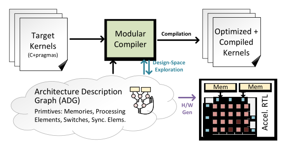
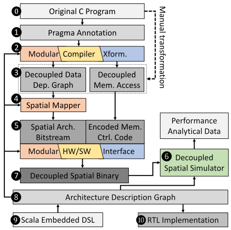

Micro 2022 Tutorial
================================

Organizers
----------

| `Jian Weng`_, `Sihao Liu`_, `Dylan Kupsh`_, `Tony Nowatzki`_
| `PolyArch Research Group`_.
| University of California, Los Angeles
| Date/Time: Sunday October 2nd, 1:00pm - 5:00pm CDT

.. _Jian Weng: http://were.github.io/
.. _Sihao Liu: http://web.cs.ucla.edu/~sihao/
.. _Dylan Kupsh: https://web.cs.ucla.edu/~dkupsh/
.. _Tony Nowatzki: http://web.cs.ucla.edu/~tjn/
.. _PolyArch Research Group: https://polyarch.cs.ucla.edu/

Tutorial Overview
-----------------

   **Figure 1:** Synthesizing Programmable Accelerators.

Because of the wanning benefit of transistor scaling, significant research has emerge for specialized accelerators, becuase of their promising performance and energy saving. While effective, the require intensive engineering for the hardware and software, and this efforts will be repeated when the underlying application domain shifts.

Ideally, one will be able to generate the accelerators based on the behaviors of the applications, and where these applications can be specified in a set of stead and user-friendly programming interfaces. In other words, we require a high-level synthesis flow for programmable accelerators. Figure 1 shows the paradigm of synthesizing programmable accelerators. In this tutorial, we will present our approach for programmable accelerator along with a research framework: DSAGEN, a full-stack infrastructure includes compilation, simulation, and RTL implementaion.

The first principle of our approach is to define a useful but restricted design space. Specifically we use decoupled-spatial accelerators, where memory accesses are decoupled from computation pipelines, and the underlying hardware network/storage/timing is exposed in the ISA. The second principle is to enable a rich accelerator design space by specifying architectures as a composition of simple primitives, including memories, processing elements, and network/synchronization components. An architecture instance can be represented as graph – the architecture description graph (ADG) – where each node is a hardware primitive. The ADG is an abstraction for the compiler (it is used to derive the ISA) as well as RTL generation.

**DSAGEN Framework:** This approach is embodied in our framework, DSAGEN, which is overviewed in Figure 2. DSAGEN targets C programs with custom, but application neutral pragmas. The compiler infrastructure uses Clang and LLVM as a frontend, and ultimately represents programs as a decoupled dataflow graph + memory streams. A low-level assembly-level interface is provided for ninja programmers. We include a custom spatial-architecture compiler and backend. The hardware design space includes many spatial architecture optimizations from prior works [1]–[4]. The compiler backend generates programs embedded in a RISCV ISA for control. DSAGEN supports multicore simulationi in gem5, and it uses Chisel for hardware generation.

Syllabus and Schedule
---------------------

   **Figure 2:** An Overview of the DSAGEN Stack.

..

   :download:`slides<slides/tutorial-intro.pptx>`

**Introduction (20 Minutes):** [:download:`slides<slides/tutorial-intro.pptx>`] (coming soon)

* Introduction to Decoupled-Spatial Accelerators
* DSAGEN: A Framework for Decoupled-Spatial Accelerator Research

**Basic Programming (40 Minutes):** [slides] (coming soon)

* Building DSAGEN
* Vector Addition
   * Hardware/Software Interface Overview
   * Writing a Dataflow Graph
   * Writing the Control Intrinsics
* Vector Normalization
   * Signaled Accumulation
   * Concurrent DFG's
   * Additional Control Intrinsics
* Compilation Limitations

**5-Minute Break**

**Design-Space Exploartion (40 Minutes):** [slides] (coming soon)

* Automatically Optimizing Accelerator using the Design Space Explorer

**5-Minute Break**

**Handcrafting Architectures:** [slides] (coming soon)

**Extending DSAGEN for your Own Research** [slides] (coming soon)

Docker Build
------------

Related Papers
--------------

1. V. Dadu and T. Nowatzki, “Towards general purpose acceleration by exploiting common data-dependence forms,” in 52nd MICRO, 2019.

2. T. Nowatzki, V. Gangadhar, N. Ardalani, and K. Sankaralingam, “Streamdataflow acceleration,” in 44th ISCA, 2017

3. J. Weng, S. Liu, V. Dadu, Z. Wang, and T. Nowatzki, “Dsagen: Synthesizing programmable spatial accelerators,” in ISCA, 2020.

4. J. Weng, S. Liu, Z. Wang, V. Dadu, and T. Nowatzki, “A hybrid systolicdataflow architecture for inductive matrix algorithms,” in HPCA, 2020.

.. toctree::
   :maxdepth: 1

