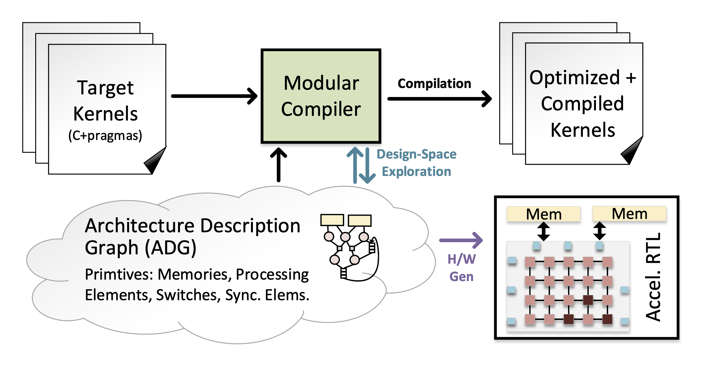
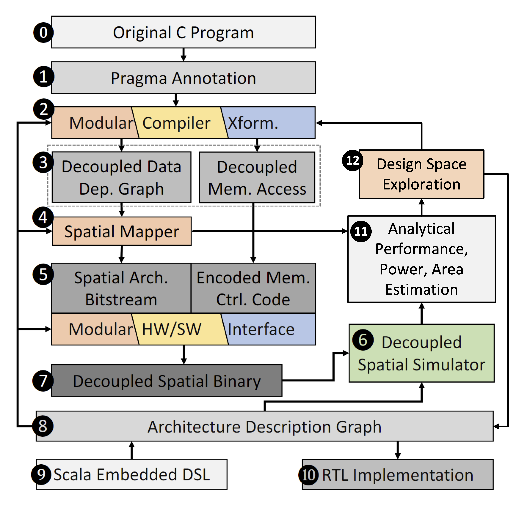

MICRO 2022 Tutorial
================================

.. figure:: images/dsagen.png

Organizers
----------

| `Sihao Liu`_, `Jian Weng`_, `Dylan Kupsh`_, `Tony Nowatzki`_
| `PolyArch Research Group`_.
| University of California, Los Angeles
| Date/Time: Sunday October 2nd, 1:00pm - 5:00pm CDT

.. _Sihao Liu: http://web.cs.ucla.edu/~sihao/
.. _Jian Weng: http://were.github.io/
.. _Dylan Kupsh: https://web.cs.ucla.edu/~dkupsh/
.. _Tony Nowatzki: http://web.cs.ucla.edu/~tjn/
.. _PolyArch Research Group: https://polyarch.cs.ucla.edu/

Tutorial Overview
-----------------

   **Figure 1:** Programmable Accelerator Synthesis.

As a reaction to the slowing of transistor scaling, significant research has emerged for specialized accelerators, because of their promise of high performance and energy savings.  While extremely effective, they require intensive engineering of hardware and software -- an effort that must be repeated when new domains arise and when algorithms change.

Ideally, one would be able to generate accelerators based on the behaviors and structure of target applications, and where these applications are specified in a stable and friendly programming interface.  In other words, we require the equivalent of high-level synthesis (HLS), but for programmable accelerators -- programamble accelerator synthesis. Figure 1 highlights the high-level flow of this paradigm; the compiler simultaneously analyzes multiple kernels, then performs design space exploration using modeling, and ultimately produces optimized kernels along with the accelerator RTL.

The challenges with this paradigm include: How to represent a useful design space, that is broad, easily searchable, and enables significant specialization? How to compile programs from a general language without hindering specialization benefits? How to search this design space efficiently?

In this tutorial, we will present one such approach for programmable accelerator synthesis, along with a corresponding framework: **DSAGEN**, a research infrastructure including compilation, simulation and RTL implementation.  

Syllabus and Schedule
---------------------

   **Figure 2:** The framework stack of DSAGEN.

.. download link :download:`slides<slides/tutorial-intro.pptx>`

**Introduction (30 Minutes):** [slides coming soon]

- The Decoupled-Spatial Programming Paradigm
- Composing Hardware with Essential Primatives
- The DSAGEN Framework Stack

**Basic Programming (60 Minutes):** [slides coming soon]

- Introduction to the Automated Compilation flow

   + Annotating Programs with Pragmas
   + Pragma parsing in *clang* and how *llvm* passes interpret to encode data accesses
   + Spatial Mapper Algorithm overview for Decoupled Compuation and Visualization
   + Generating Assembly Code and linking with *gnu-riscv-gcc*
   + Simulating RISC-V binary with gem5

- Hands-on exercises:

   + Change pragma as different compiler transformations
   + Visualize the difference of spatial mapping 
   + Simulate RISC-V binary on gem5 simulator to show performance difference

**10-Minute Break**

**Build your own Domain-specific Accelerator (60 Minutes):** [slides coming soon]

- Introducing the concept of Architecture Description Graph (ADG)

   + Design-space and micro-architecture DSA
   + Exporting designs as ADG and simulating RISC-V binary on RTL-level
   + Analytical Power/Performance/Area modeling

- Hands-on exercises:

   + Compose a larger ADG with new operation and different topology by DSL
   + Visualize the difference of ADG and spatial mapping
   + Showing difference of estimated power/performance/area on different hardware designs
   + Performance analysis on how hardware feature affect performance and hardware consumption

**10-Minute Break**

**Automatic Design Space Exploration: (40 Minutes)** [slides coming soon]

- Introduction to the Design Space Explorer
   
      + An end-to-end flow from a set of programs to auto-generated accelerators
      + Introducing DSE to achieve better Power/Performance/Area
      + Key DSE-specific techniques

- Hands-on exercises:
   
      + Perform DSE on a small set of kernels
      + Measure performance on generated accelerator
      + Visualize the DSE process and generated accelerator designs

Installing DSAGEN
------------------

To build the DSAGEN Framework, you will need to install Docker. Please follow the instructions on the official `docker website`_.

.. _docker website: https://docs.docker.com/engine/install/ubuntu/

Start by cloning the repository:

.. code-block:: bash

   $ git clone https://github.com/PolyArch/dsa-framework.git
   $ cd dsa-framework

Then, build the docker image:

.. code-block:: bash

   $ docker build .

Related Papers
--------------

#. S. Liu, J. Weng, D. Kupsh, A. Sohrabizadeh, Z. Wang, L. Guo, J. Liu, M. Zhulin, L. Zhang, J. Cong, T. Nowatzki, "OverGen: Improving FPGA Usability through Domain-specific Overlay Generation" in MICRO, 2022. [`paper <https://polyarch.cs.ucla.edu/papers/micro2022-overgen.pdf>`_][`cite <cites/overgen.bib>`_]
#. J. Weng, S. Liu, V. Dadu, Z. Wang, and T. Nowatzki, “DSAGEN: Synthesizing programmable spatial accelerators” in ISCA, 2020.
#. J. Weng, S. Liu, Z. Wang, V. Dadu, and T. Nowatzki, “A hybrid systolicdataflow architecture for inductive matrix algorithms” in HPCA, 2020.
#. V. Dadu and T. Nowatzki, “Towards general purpose acceleration by exploiting common data-dependence forms” in 52nd MICRO, 2019.
#. T. Nowatzki, V. Gangadhar, N. Ardalani, and K. Sankaralingam, “Stream-Dataflow Acceleration” in 44th ISCA, 2017

.. toctree::
   :maxdepth: 1

